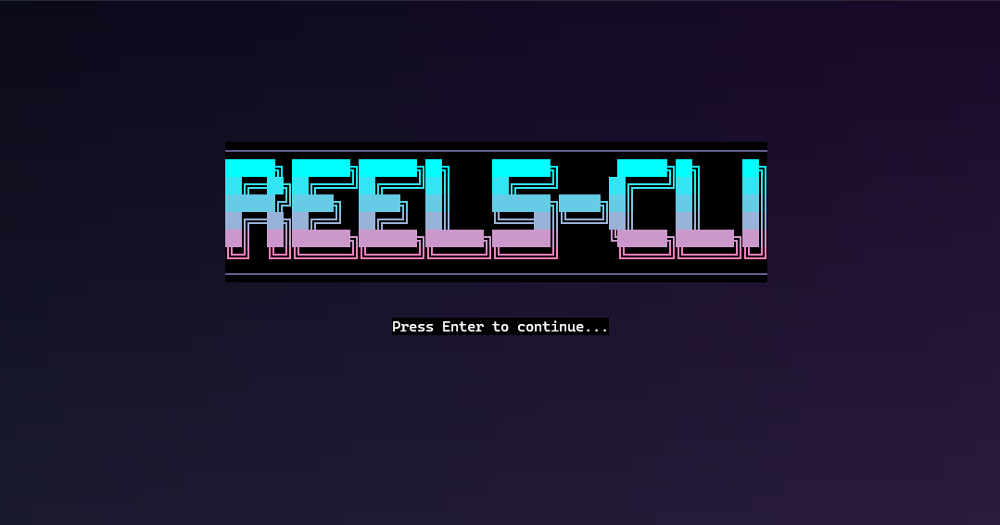

# reels-cli: Instagram reels right in your terminal!

Everyone in the tech world is too obsessed with productivity these days. Day after day, somebody always seems to post about their "ai-led study app" or their "ultra-productive ai-workflows". Clearly, everyone is too productive these days!! Thus, I volunteered to balance things out.

This is why I made `reels-cli`. This project allows you to watch Instagram reels within your terminal, right where developers do their hardest work, making them less productive. No need to spend the extra two seconds to open a chrome tab! Even better, it plays videos directly from your personal instagram algorithm! 

Built with C and Python. Special shoutout to [notcurses](https://github.com/dankamongmen/notcurses) and [instagrapi](https://github.com/subzeroid/instagrapi) for their amazing libraries.



## About
Yes, this project does work. It plays videos directly from your Instagram algorithm (explore page, though). There is even audio and video playback as well! 

The controls are simple:
- <kbd>q</kbd> to quit
- <kbd>Space</kbd> to pause/play
- <kbd>Up</kbd>/<kbd>Down</kbd> to scroll

That's it! 

## Installation

> [!IMPORTANT]
> There is no built release for this project. Setting this up may be painful, and it is not guaranteed to work on all systems. For reference, I am using WSL2 (2.4.12) on Windows 11 with Ubuntu 24.04, using the default WSL terminal (non administrator). A terminal emulator with proper graphics support (think Kitty, etc.) would probably work better. Heavy tinkering will probably be required to get this working on your system, **use at your own risk**. 

> [!CAUTION]
> **There are no guarantees that this will work on your system. I made this project for personal and educational use!!!**

### Prerequisites

- **Linux operating system** (tested on Ubuntu 24.04, WSL2)
- **GCC compiler** with C99 support
- **Python 3.8+** with pip
- **Git** for cloning the repository

### Quick Installation

1. **Clone the repository:**
    ```bash
    git clone <repository-url>
    cd reels-cli
    ```

2. **Install system dependencies:**
    
    **Ubuntu/Debian:**
    ```bash
    sudo apt-get update
    sudo apt-get install build-essential python3 python3-pip python3-venv \
                         libnotcurses-dev libavformat-dev libavcodec-dev \
                         libavutil-dev libswscale-dev libswresample-dev libao-dev
    ```

3. **Set up Python environment:**
    ```bash
    cd python
    python3 -m venv .venv
    source .venv/bin/activate
    pip install -r requirements.txt
    cd ..
    ```

4. **Build the C application:**
    ```bash
    cd c
    make
    cd ..
    ```

5. **Configure Instagram credentials:**
> [!CAUTION]
> Instagrapi is NOT an unfoficial API. This is a violation of Instagram's terms of service. Use at your own risk. My own alt account was flagged for suspicious behaviour multiple times during testing.
    Edit `python/main.py` and replace the placeholder credentials:
    ```python
    USERNAME = "your_instagram_username"
    PASSWORD = "your_instagram_password"
    ```

6. **Make the launcher globally accessible (optional):**
    Run this in the `reels-cli` directory:
    ```bash
    sudo ln -sf "$(pwd)/run.sh" /usr/local/bin/reels-cli
    ```
    This allows you to run `reels-cli` from anywhere.

### Running the Application

**If you installed globally:**
```bash
reels-cli
```

**Or run directly:**
```bash
./run.sh
```

### Build Options

The Makefile provides several build targets:

- **Standard build:** `make` (optimized for performance)
- **Performance build:** `make performance` (maximum optimizations)
- **Clean build:** `make clean` (remove build artifacts)

## Dependencies

### C Dependencies
- `libnotcurses-core` and `libnotcurses` (terminal graphics)
- `libavformat`, `libavcodec`, `libavutil` (FFmpeg video processing)
- `libswscale`, `libswresample` (FFmpeg scaling and resampling)
- `libao` (audio output)
- `pthread` (threading support)

### Python Dependencies

> [!NOTE]
> Given the nature of being an unofficial Instagram API, the `instagrapi` library may break if Instagram updates their API. Please check the [instagrapi GitHub](https://github.com/subzeroid/instagrapi/tree/master/instagrapi) for updates. It currently uses version `2.1.5`, but you may need to update it in the future.

- `instagrapi==2.1.5` (Instagram API client) 

## Architecture

The application consists of two main components:

1. **C Video Player** (`c/` directory):
   - Built with notcurses for terminal graphics
   - Uses FFmpeg for video/audio processing
   - Communicates with Python client via Unix Domain Socket (UDS)
   - Handles video playback, user input, and terminal rendering

2. **Python Instagram Client** (`python/` directory):
   - Uses instagrapi to fetch Instagram reels
   - Communicates with C player via UDS
   - Handles Instagram authentication and API calls
   - Communicates video URLs to the C player


## Troubleshooting

There are many points of failure, particularly involved with audio and video playback. You can use tools like `mpv` and `ffplay` to test video and audio playback from URLs directly to ensure your system is configured correctly. 

Look into `python/logs` for any errors with Instagram login or fetching reels.

My setup for reference:
- WSL2 on Windows 11, WSL version 2.4.12
- Ubuntu 24.04
- Windows Terminal Version 1.22.12111.0
- `gcc` 13.3.0
- `python3` 3.12.3
- `build-essential` 12.10ubuntu1
- `python3` 3.12.3-0ubuntu2
- `python3-pip` 24.0+dfsg-1ubuntu1.2
- `libnotcurses-dev` 3.0.7+dfsg.1-1ubuntu5
- `libavformat-dev` 7:6.1.1-3ubuntu5
- `libavcodec-dev` 7:6.1.1-3ubuntu5
- `libavutil-dev` 7:6.1.1-3ubuntu5
- `libswscale-dev` 7:6.1.1-3ubuntu5
- `libswresample-dev` 7:6.1.1-3ubuntu5
- `libao-dev` 1.2.2+20180113-1.1ubuntu4


## Bugs, TODOs, and More

This project has many potential points of failures. If Instagram updates their API, the `instagrapi` library may break. Additionally, audio and video playback can be tricky depending on your system configuration.

Depending on your system specifications and internet speeds, video playback may be choppy as well. This project was not built for performance, but rather as a fun experiment.

Here are some improvements and TODOs in order of importance:
- Audio likes to crackle a lot, this NEEDS to be fixed (but I have not much idea how)
- The performance of the video player is horrible (this is probably related to the audio issues)
- Login directly over command line arguments/environment variables rather than hardcoding in the script
- The code is a mess, needs a better file structure and refactoring
- Improve video playback performance (buffering, etc.)
- Video playback optimizations (caching, preloading videos, etc.)
- Implement better error handling and logging
- Simpler interface; log-in directly from the terminal interface
- Add support for more Instagram features (reading comments, commenting, liking, is definitely possible)

I probably won't be working on this project much more, especially as it was already quite out of my depth (the audio system is horrible and I have not much clue how it works).
